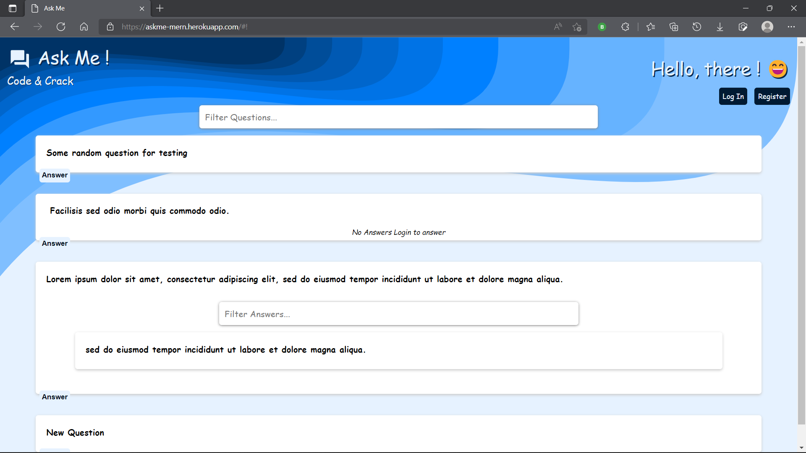
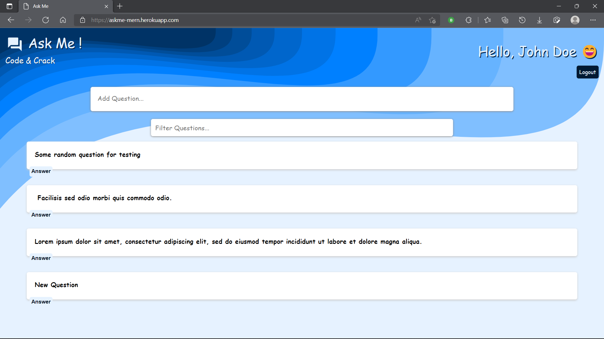
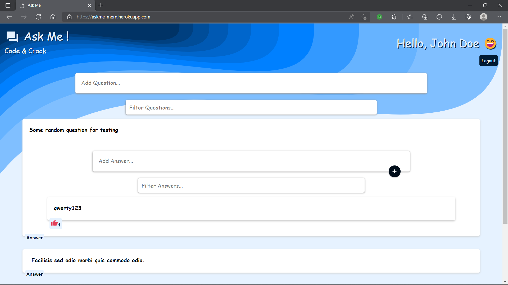
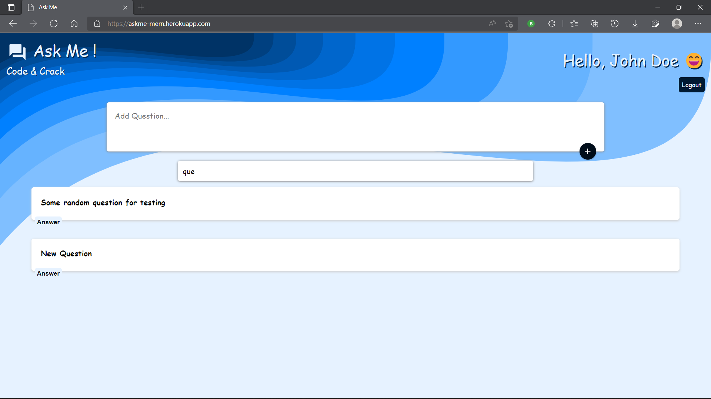
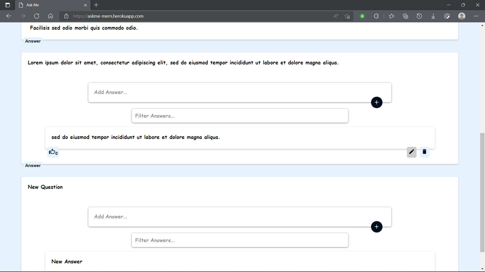

# Askme
Web app using MERN stack

## Here is the look of various pages:
* logout page where users can watch questions and answers but can't ask a question or answer to any question:

* Home page after login

* After login user can also like answers

* User can filter questions and answers 

* User can edit or delete own content

